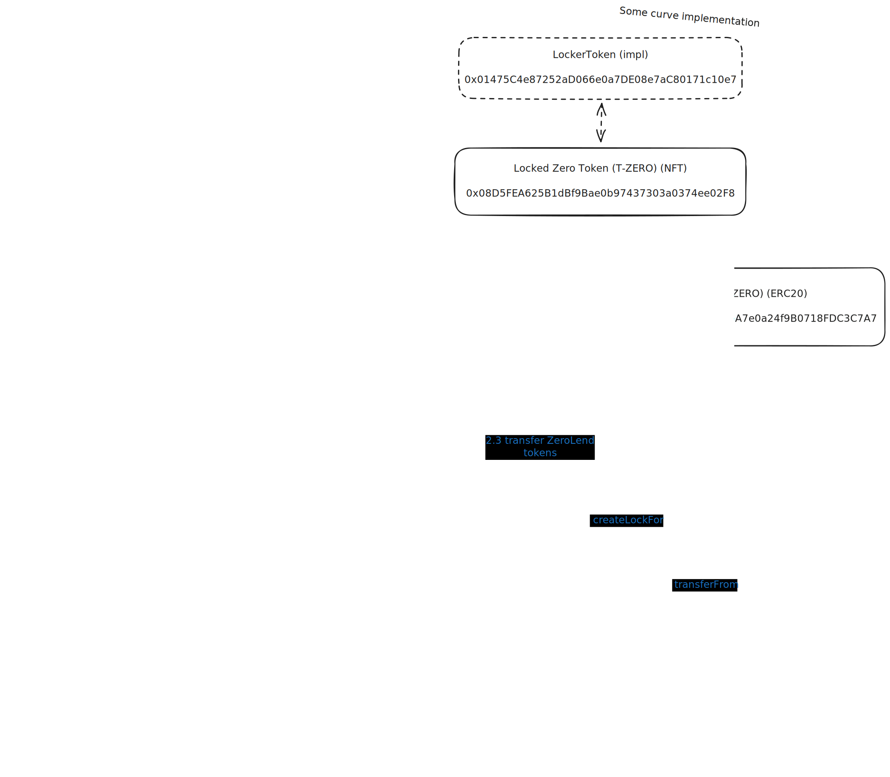
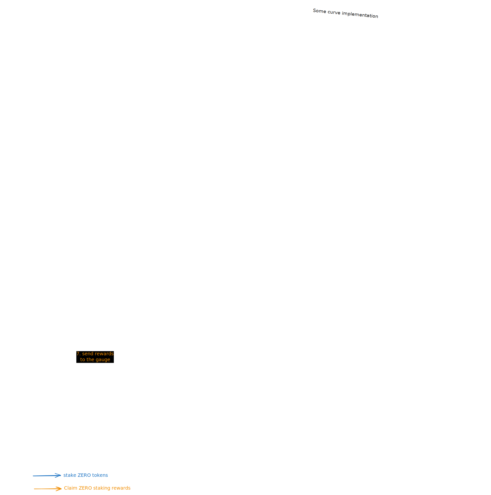

# StakeDAO ZeroLend Locker

This document's goal is to outline the particularities of the ZeroLend veTokenomics and its StakeDAO locker's implementation.

## Chain

Linea

## Diagrams

#### 1. Native staking & claiming

[→ staking example](https://lineascan.build/tx/0xa6e504332ce9b33fa3d243a6061c35e13d64668dabe402fc1318ba585e239a8f)

[→ claiming example](https://lineascan.build/tx/0xa24f160715bf16c796ef4bef29508d8abb5f47cfcec86c0bceef3df4d6526ce4)

### 2. stakeDAO locker implementation

**⚠️ Important**

- The SDT token is not deployed on Linea so we use the LiquidityGaugeV4XChain.vy implementation which doesn't have any SDT boosting for sdZERO-gauge holders.
- For better composability and upgradeability, we removed the `claimRewards()` function from the locker and instead, the accumulator calls the `execute(address to, uint256 value, bytes calldata data)` function.

## List of contracts

| name                       | address                                                                                                                  | proxy | used in SD integration |
| -------------------------- | ------------------------------------------------------------------------------------------------------------------------ | ----- | ---------------------- |
| ZeroLend (ZERO)            | [0x78354f8DcCB269a615A7e0a24f9B0718FDC3C7A7](https://lineascan.build/address/0x78354f8DcCB269a615A7e0a24f9B0718FDC3C7A7) | ❌    | ✅                     |
| Locked Zero Token (T-ZERO) | [0x08D5FEA625B1dBf9Bae0b97437303a0374ee02F8](https://lineascan.build/address/0x08D5FEA625B1dBf9Bae0b97437303a0374ee02F8) | ✅    | ✅                     |
| ZERO Voting Power (ZEROvp) | [0xf374229a18ff691406f99CCBD93e8a3f16B68888](https://lineascan.build/address/0xf374229a18ff691406f99CCBD93e8a3f16B68888) | ✅    | ✅                     |
| StakingBonus               | [0xd676c56a93fe2a05233ce6eafefde2bd4017b3ea](https://lineascan.build/address/0xd676c56a93fe2a05233ce6eafefde2bd4017b3ea) | ✅    | ❌                     |
| VotingPowerCombined        | [0x2666951A62d82860E8e1385581E2FB7669097647](https://lineascan.build/address/0x2666951A62d82860E8e1385581E2FB7669097647) | ✅    | ❌                     |

## Discrepancies with other veTokenomics

- ZeroLend's voting escrowed token is not called veZERO but ZEROvp (ZERO voting power)
- Tracking stakes through NFTs

ZERO locks are tracked through ERC721 NFT tokens, each having a _start_, _end_, _amount_ and _power_ value. A user can create and manage multiple locks (NFTs) with different values. It's possible to merge these tokens. The NFTs can be transferred. In order to receive voting power (ZEROvp), the NFT needs to be staked in the ZEROvp contract. The NFT can be unstaked at any time from the ZEROvp contract. It needs to reach the _end_ time in order to be released and to get the ZERO tokens back.

- ZEROlp staking

There are two types of staking. ZERO staking and lpZERO staking. ZERO staking receives ZERO emissions while lpZERO receives protocol revenue (WETH). The StakeDAO locker focuses on ZERO staking as it will soon be updated to also receive 50% of protocol revenue, making it the better choice out of the two systems.

- ZeroLend contracts are highly upgradeable through proxies. It's important to make sure that no breaking changes are introduced, particularly regarding the interfaces used by the locker contract.

## Next steps

- Integration of WETH rewards by ZeroLend, then add the reward to the gauge
- Integration of stake NFT splitting by ZeroLend

## Useful links

- [staking dApp](https://one.zerolend.xyz/stake/)
- [documentation](https://docs.zerolend.xyz/governance/token-overview)
- [contracts](#list-of-contracts)
