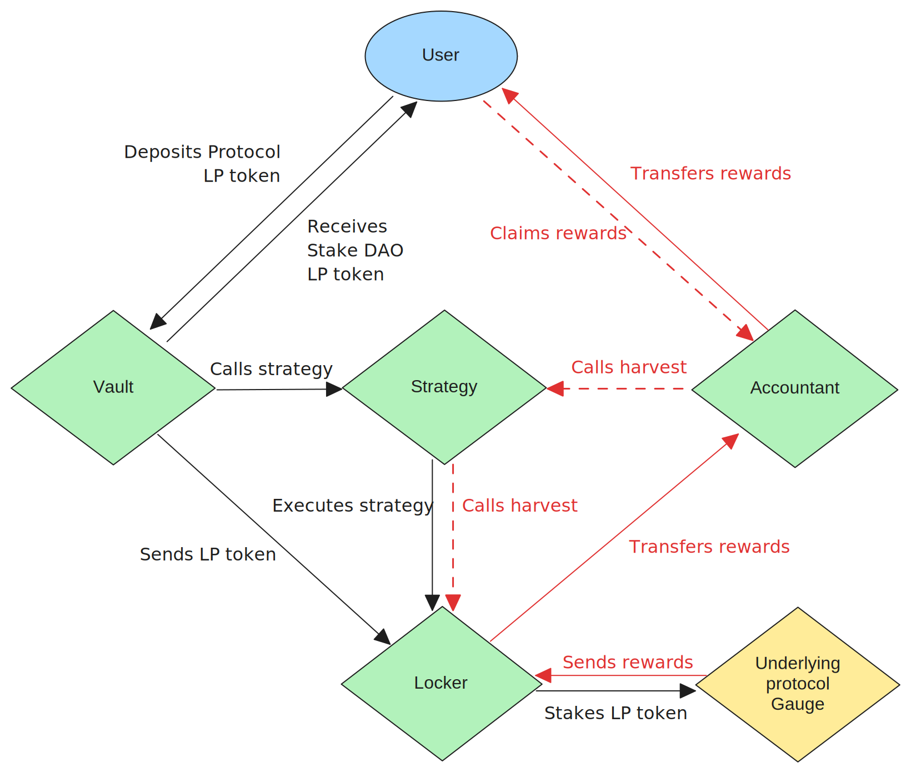

# Stake DAO Staking v2

```
              #####
      #################
    ########################
  #################################
 ######################################
 #######################################
########################################
######       ##########################
 #####       #########################
  #######   ##############   ## #######
    #####  ###########      #### ######
          ###### #####      ##### ######
         ######   #####     #####  #####
        ######    #####     #####   #### Staking v2
```

[](https://github.com/stake-dao/contracts-monorepo/actions/workflows/strategies_unit-tests.yml)
[](https://github.com/stake-dao/contracts-monorepo/actions/workflows/strategies_coverage.yml)
[](https://github.com/stake-dao/contracts-monorepo/actions/workflows/strategies_docs.yml)

## Overview

Stake DAO Staking v2 is the next-generation yield aggregator protocol, designed to address the limitations of traditional DeFi vaults. It delivers instant, accurate, and portable rewards, eliminates reward dilution, and dramatically reduces harvest costs. This documentation is intended for integrators, contributors, and auditors. **User-facing documentation is available at [https://docs.stakedao.org/](https://docs.stakedao.org/).**

- **Product page:** [https://www.stakedao.org/yield](https://www.stakedao.org/yield)
- **User documentation:** [https://docs.stakedao.org/strategies](https://docs.stakedao.org/strategies) [WIP 🚧]

For a detailed analysis of all contracts, their responsibilities, and how the system works, please refer to the [SPEC.md](./documentation/SPEC.md) file. It contains in-depth documentation of the protocol architecture, component interactions, and process flows.

## Key Features

- **Instant reward distribution:** Users receive rewards as soon as they are generated. No more streaming delays.
- **Zero reward loss on withdrawal:** All accrued rewards are claimable upon withdrawal.
- **No reward dilution:** The Accountant contract ensures new depositors cannot dilute existing users' rewards.
- **Cross-vault reward pooling:** Rewards are pooled per protocol, not per vault, enabling more frequent and efficient harvests.
- **5x lower harvest costs:** Harvester fees are reduced from 0.5% to 0.05%.
- **Full reward portability:** Users can move between vaults without losing rewards or waiting for ramp-up periods.
- **Audited and permissioned:** Security and compliance features, including emergency shutdown and granular permissions.

These improvements enable dynamic fund management across all Stake DAO vaults. Staking Architecture v2 is also compatible with [OnlyBoost](https://github.com/stake-dao/only-boost), making it the most attractive solution for liquidity provision on all supported protocols.

## Architecture

Staking v2 introduces a modular architecture with the following core contracts:

- **ProtocolController:** Manages protocol-wide permissions and components.
- **ProtocolContext:** Provides shared protocol logic and configuration for strategies and harvesters.
- **RewardVault:** User entrypoint. Handles deposits, withdrawals, and manages extra rewards (distributed traditionally).
- **Accountant:** Tracks and allocates rewards per user, ensuring instant and accurate distribution.
- **Strategy:** Executes yield-generating logic and interacts with underlying protocols.
- **Allocator:** Handles optimal distribution of deposited funds across multiple yield strategies.
- **Sidecar:** Provides auxiliary features and integrations.

The Accountant contract enables cross-vault reward pooling, so rewards from all pools of a given protocol are distributed instantly and fairly to users. Extra rewards (e.g., pool-specific incentives) are managed by the RewardVault and distributed using the traditional mechanism.

### Protocol Flow Diagram

Below is a diagram illustrating the deposit and withdraw flow in Staking v2:



## Integrated Protocols

| Protocol | Status  |
| -------- | ------- |
| Curve    | Planned |
| Balancer | Planned |
| Pendle   | Planned |
| Yearn    | Planned |

> You can find all the deployed Stake DAO contracts [here](https://github.com/stake-dao/offchain-registry/).

## Contributing

> **Note:** Before running or testing the project, you must create a `.env` file in the root of this package and populate it with the required keys from the `.env.example` file. This is necessary for local development and CI to work correctly.

This package is a Foundry-based smart contract project and targets Solidity version `0.8.28`.

### Setup

To install all dependencies for this package, run the following command at the root of the repository:

```sh
pnpm install
```

### Quality

We enforce consistent code style and quality using the following tools:

- **Formatting:** [Forge fmt](https://book.getfoundry.sh/forge/formatting) is used to automatically format Solidity code.
- **Linting:** [solhint](https://github.com/protofire/solhint) is used to lint Solidity code for style and best practices.

To check code formatting and linting, run:

```sh
make lint
```

To automatically fix formatting and linting issues, run:

```sh
make lint-fix
```

Please ensure your code passes these checks before submitting a pull request.

### Testing

We use the **Branching Tree Technique (BTT)** to structure test specifications, which enhances clarity and coverage by modeling test cases as branching decision trees.

#### Branching Tree Technique

Test specifications are written using BTT. For more information, see:

- [Paul R. Berg's Introduction to BTT](https://x.com/PaulRBerg/status/1682346315806539776)
- [BTT Overview by Shubhchain](https://shubhchain.hashnode.dev/smart-contract-testing-made-easy)
- [Example BTT Implementations](https://github.com/PaulRBerg/btt-examples)

#### Generating Tests with Bulloak

We recommend using [Bulloak](https://github.com/alexfertel/bulloak) to generate test files from BTT specifications automatically.

To scaffold test files from your branching tree specification, run:

```sh
bulloak scaffold -w <file_name>.tree -s 0.8.28
```

## Security & Compliance

- **Audits:** The contracts have been audited by Trust Security and Omniscia. Audit reports are available in the [`audit/`](audit/) directory.
- **Permission system:** Granular, contract-level permissions are managed by the ProtocolController.
- **Emergency shutdown:** Both gauge-level and protocol-level shutdowns are available for rapid response to threats.
- **Compliance:** The protocol is non-custodial, open-source, and subject to DAO governance. Users are responsible for their own legal compliance.

## License

This package is licensed under the Business Source License (BSL). See the LICENSE file for details. The BSL expires on **January 1, 2028** or as set on-chain.

## Contact

For questions, support, or partnership inquiries, please contact: [contact@stakedao.org](mailto:contact@stakedao.org)
