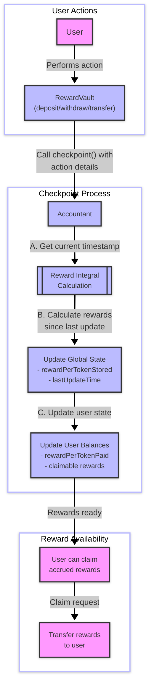
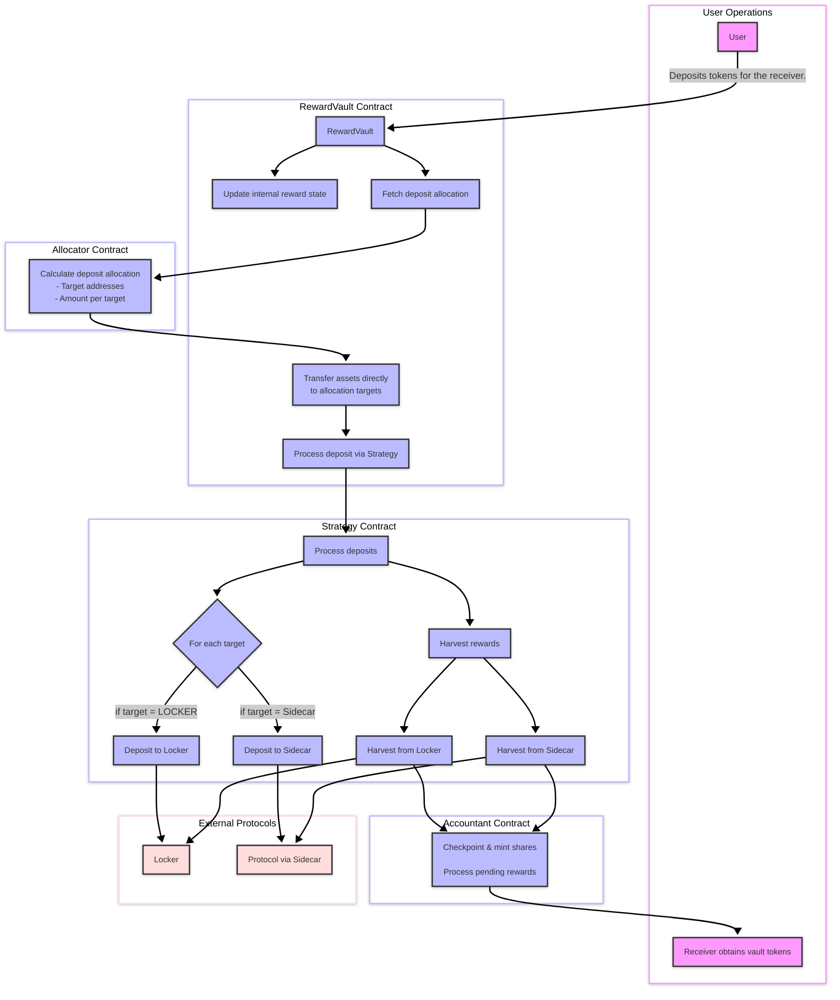
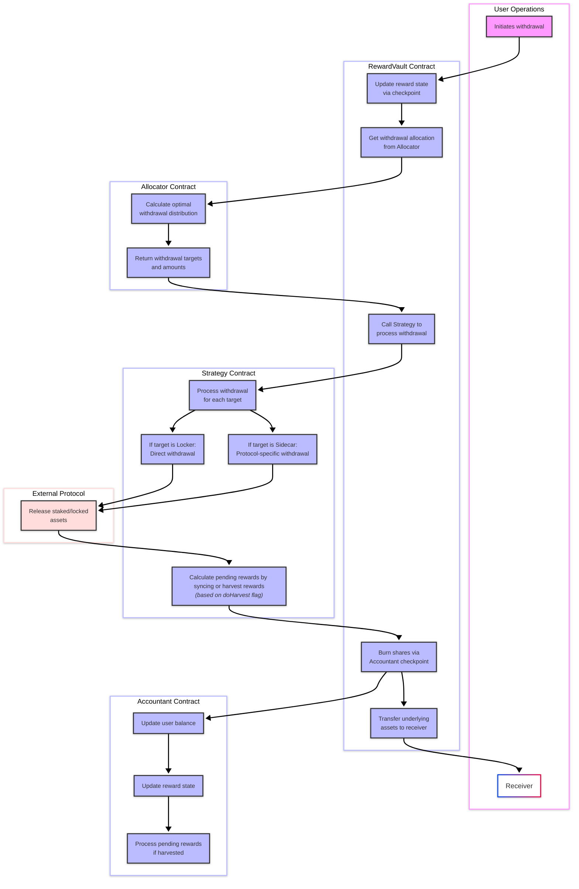
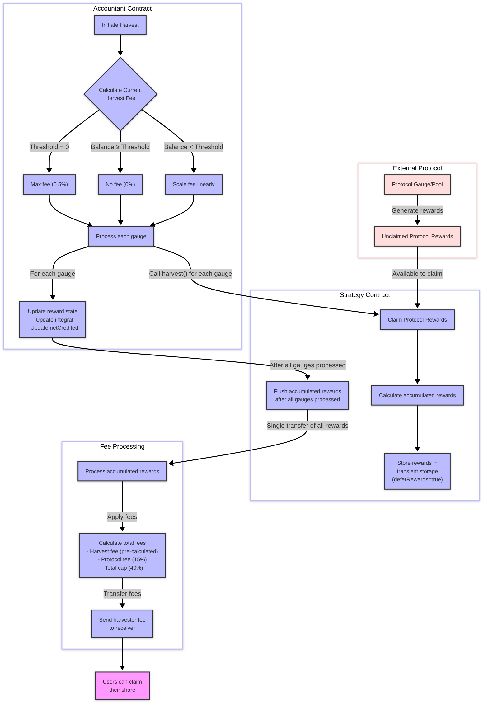

# Stake DAO V2 — System Specification

## 1. System Architecture Overview

Stake DAO V2 is a modular, gas-efficient yield optimization protocol designed to source rewards from various DeFi platforms (Curve, Balancer, Pendle, etc.) while providing a unified user experience. The system employs a component-based architecture with clear separation of concerns to enable flexible reward streaming, multi-chain deployment, and seamless protocol integrations.

### Core Design Principles

1. **Modularity**: Each component has a single responsibility and well-defined interfaces
2. **Gas Efficiency**: Optimized storage layouts and integral-based reward calculations
3. **Extensibility**: Protocol-agnostic design allows for easy integration with new yield sources
4. **Security**: Multi-layered permission system and emergency shutdown capabilities

## 2. Core Components

### 2.1 ProtocolController

The ProtocolController serves as the central registry and permission management system for the entire protocol.

**Key Responsibilities:**

- Maintains a registry of all protocol components (Vaults, Strategies, Allocators, etc.)
- Manages permissions through a flexible access control system
- Provides emergency shutdown capabilities at both protocol and gauge levels
- Enables component upgradability without full system redeployment

**Technical Implementation:**

- Uses a bytes4 protocol ID to identify different protocol integrations
- Implements a permission system with granular function-level access control
- Stores component addresses in optimized storage structures

### 2.2 Vaults (RewardVault)

Vaults are the primary user entry points for depositing and withdrawing assets.

**Key Responsibilities:**

- Implements ERC4626 standard for maximum composability
- Coordinates with Allocator to determine optimal asset deployment
- Notifies Accountant of user actions (deposits, withdrawals, transfers)
- Manages additional reward tokens beyond the primary protocol reward

**Technical Implementation:**

- Extends ERC20 with ERC4626 functionality
- Uses clone factory pattern for efficient deployment
- Delegates reward accounting to the Accountant contract
- Support for additional reward tokens per vault

### 2.3 Allocator

The Allocator determines the optimal distribution of deposited funds across multiple yield strategies.

**Key Responsibilities:**

- Calculates optimal allocation of assets across different targets
- Provides allocation information for deposits, withdrawals, and rebalances
- Maintains a list of allocation targets for each gauge

**Technical Implementation:**

- Base implementation directs all funds to a single target (LOCKER)
- Protocol-specific implementations (e.g., CurveAllocator) can override allocation logic
- Returns structured Allocation objects containing targets and amounts

### 2.4 Strategy

Strategies implement the protocol-specific logic for interacting with external yield sources.

**Key Responsibilities:**

- Executes deposit and withdrawal operations through protocol-specific implementations
- Harvests and reports rewards from external protocols
- Manages interactions with Sidecar contracts for additional integrations
- Provides balance tracking across multiple allocation targets

**Technical Implementation:**

- Abstract base contract with protocol-specific implementations
- Uses a gateway/module manager pattern for executing transactions
- Implements virtual functions for protocol-specific operations
- Tracks pending rewards through the PendingRewards structure

### 2.5 Accountant

The Accountant is the central reward management system, handling reward distribution and fee calculations.

**Key Responsibilities:**

- Tracks user balances and rewards across all vaults using integral-based accounting
- Manages two reward streams: checkpoint rewards and harvested rewards
- Handles protocol fee collection and distribution

**Technical Implementation:**

- Uses gas-optimized packed storage for efficient reward tracking
- Implements integral-based reward calculation for precise per-user accounting
- Provides checkpoint operations for immediate reward updates
- Manages harvest operations for batch reward processing

### 2.6 Gateway (Safe Multisig)

The Gateway serves as a unified transaction execution layer for the protocol.

**Key Responsibilities:**

- Provides a consistent interface for executing transactions across multiple DeFi platforms
- Manages permissions for transaction execution
- Ensures secure interaction with external protocols

**Technical Implementation:**

- Implements Safe Multisig functionality
- Uses module manager pattern for transaction execution
- Provides standardized transaction execution interface

### 2.7 Sidecar

Sidecars provide protocol-specific integrations for external yield sources.

**Key Responsibilities:**

- Implements protocol-specific logic for interacting with external protocols
- Provides a standardized interface for deposits, withdrawals, and reward claiming
- Enables independent upgrades for protocol integrations

**Technical Implementation:**

- Abstract base contract with protocol-specific implementations
- Implements virtual functions for protocol-specific operations
- Uses a standardized interface for interaction with Strategy contracts

## 3. Core Processes

### 3.1 Reward Distribution Mechanism

Stake DAO V2 implements a dual reward stream system to balance immediate reward availability with gas efficiency.

#### 3.1.1 Checkpoint Rewards

Checkpoint rewards are processed immediately upon user actions (deposit, withdrawal, or transfer).

**Process Flow:**

1. User performs an action (deposit, withdrawal, or transfer)
2. Vault calls Accountant.checkpoint() with the action details
3. Accountant updates the reward integral and user balances
4. User can immediately claim accrued rewards

**Technical Details:**

- Uses integral-based accounting for precise reward calculation
- Processes rewards with minimal gas overhead
- Updates user-specific reward state on each action

**Flow Diagram:**

#### 3.1.2 Harvested Rewards

Harvested rewards are batch-processed when gas-efficient, according to governance-defined thresholds.

**Process Flow:**

1. Pending rewards accumulate in the Accountant
2. A harvest operation is triggered
3. Strategy claims rewards from external protocols
4. Accountant distributes rewards to users based on their share of the vault

**Technical Details:**

- Uses PendingRewards structure to track reward amounts
- Separates fee-subject amounts from total reward amounts

### 3.2 Fee Structure

The protocol implements a flexible fee structure.

#### 3.2.1 Harvest Fee (0.5%)

Fixed fee to all rewards to cover gas cost of the caller.

#### 3.2.2 Protocol Fee (15%)

Fixed fee applied to all rewards to fund protocol operations and development.

**Implementation:**

- Applied to fee-subject amounts only
- Accrued in the Accountant contract
- Claimable by the designated fee receiver

#### 3.2.3 Fee Cap (40%)

All fees combined (harvest + protocol) cannot exceed 40% of rewards.

### 3.3 Deposit Flow

**Process Flow:**

1. User deposits tokens into a Vault
2. Vault updates reward state via Accountant.checkpoint()
3. Vault consults Allocator to determine optimal asset distribution
4. Assets are transferred to the designated targets
5. Strategy executes deposit operations through protocol-specific implementations
6. Vault mints shares to the user

**Technical Details:**

- Uses ERC4626 standard for deposits
- Implements allocation-based deposit strategy
- Updates reward state before processing deposit

**Flow Diagram:**

### 3.4 Withdrawal Flow

**Process Flow:**

1. User requests withdrawal from a Vault
2. Vault updates reward state via Accountant.checkpoint()
3. Vault consults Allocator to determine withdrawal sources
4. Strategy executes withdrawal operations through protocol-specific implementations
5. Assets are transferred to the user
6. Vault burns shares from the user

**Technical Details:**

- Uses ERC4626 standard for withdrawals
- Implements allocation-based withdrawal strategy
- Updates reward state before processing withdrawal

**Flow Diagram:**

### 3.5 Harvest Mechanism

**Process Flow:**

1. Harvester reviews pending rewards in the Accountant
3. Strategy harvests rewards from external protocols
4. Accountant processes rewards, deducting fees
5. Users can claim their share of rewards

**Technical Details:**

- Implements batch harvesting for gas efficiency
- Uses dynamic fee calculation based on reward balance
- Separates fee-subject amounts from total reward amounts

**Flow Diagram:**

## 4. Integration Guide

### 4.1 Adding a New Protocol Integration

To integrate a new yield protocol with Stake DAO V2:

1. **Define Protocol ID**

   - Create a unique bytes4 identifier for the protocol

2. **Implement Strategy**

   - Extend the base Strategy contract
   - Implement protocol-specific deposit, withdraw, and harvest functions
   - Define reward synchronization logic

3. **Implement Allocator**

   - Extend the base Allocator contract
   - Define allocation logic for the protocol
   - Implement target selection for deposits and withdrawals

4. **Implement Sidecar (if needed)**

   - Extend the base Sidecar contract
   - Implement protocol-specific interactions
   - Define reward claiming logic

5. **Register Components**
   - Register components with ProtocolController
   - Set up permissions for component interactions
   - Configure fee parameters

### 4.2 Vault Deployment

To deploy a new vault for an existing protocol integration:

1. **Identify Target Gauge**

   - Select the gauge/pool to integrate with

2. **Deploy Vault**

   - Use the RewardVault implementation
   - Configure with appropriate protocol ID and gauge

3. **Register Vault**
   - Register the vault with ProtocolController
   - Set up reward tokens and distributors

### 4.3 Protocol-Specific Considerations

When integrating with specific protocols, consider:

1. **Boost Mechanisms**

   - Configure optimal boost allocation

2. **Reward Claiming**

   - Implement protocol-specific reward claiming logic
   - Handle multiple reward tokens if necessary

3. **Security Constraints**
   - Respect protocol-specific security requirements
   - Implement appropriate validation checks

## 5. Security Considerations

### 5.1 Permission System

The protocol implements a granular permission system through ProtocolController:

- Function-level permissions for contract interactions
- Designated permission setters for managing access
- Owner-controlled critical functions

### 5.2 Emergency Shutdown

Two levels of emergency shutdown are available:

1. **Gauge Shutdown**

   - Disables operations for a specific gauge
   - Allows users to withdraw funds

2. **Protocol Shutdown**
   - Disables all operations for a protocol integration
   - Affects all gauges associated with the protocol

### 5.3 Reentrancy Protection

The protocol implements reentrancy protection through:

- ReentrancyGuardTransient for critical functions
- Proper check-effects-interactions pattern
- Safe external calls

## 6. Roadmap

### 6.1 Deployment Standardization

**Objective:** Ensure the V2 system design is modular and flexible for deployment on any yield source.

**Implementation Plan:**

- Standardize interfaces for protocol integrations
- Develop adapter patterns for new yield protocols
- Create deployment templates for rapid integration

### 6.2 CollateralWrapper & Factory for Lending Markets

**Objective:** Enable vault positions to be used as collateral in lending markets.

**Implementation Plan:**

- Develop CollateralWrapper contract to tokenize vault positions
- Implement Factory pattern for automated wrapper deployment
- Create adapters for major lending protocols (Morpho, Inverse, etc.)

### 6.3 Developer Experience Improvements

**Objective:** Minimize integration overhead for protocols to leverage Stake DAO yields.

**Implementation Plan:**

- Create detailed documentation and integration guides
- Provide reference implementations for common use cases

## 7. Glossary

- **Gauge:** External protocol's staking contract (e.g., Curve Gauge)
- **Vault:** User-facing contract for deposits and withdrawals
- **Strategy:** Protocol-specific implementation for yield generation
- **Allocator:** Component that determines optimal asset allocation
- **Accountant:** Central reward tracking and distribution system
- **Sidecar:** Protocol-specific adapter for external integrations
- **Gateway:** Transaction execution layer for external interactions
- **Checkpoint Rewards:** Immediately accessible rewards from user actions
- **Harvested Rewards:** Batch-processed rewards for gas efficiency
